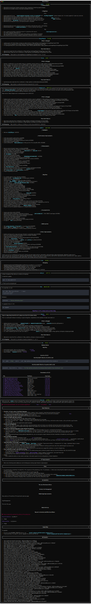

# GitHub Feed

The [GitHub activity feed is broken](https://github.com/orgs/community/discussions/122324), so I decided to reimplement it in the terminal.

## Goals

- [x] Store list of user's starred repos locally in sqlite database
- [x] Retrieve list of releases using GitHub REST API and display on console
- [ ] Allow user to specify how far in the past to query for when finding releases
- [ ] Cache release data locally to avoid needless GitHub API usage
- [ ] Transform from basic CLI that uses [`rich`](https://github.com/Textualize/rich) to a TUI using [`textual`](https://github.com/Textualize/textual)

## Example Output

